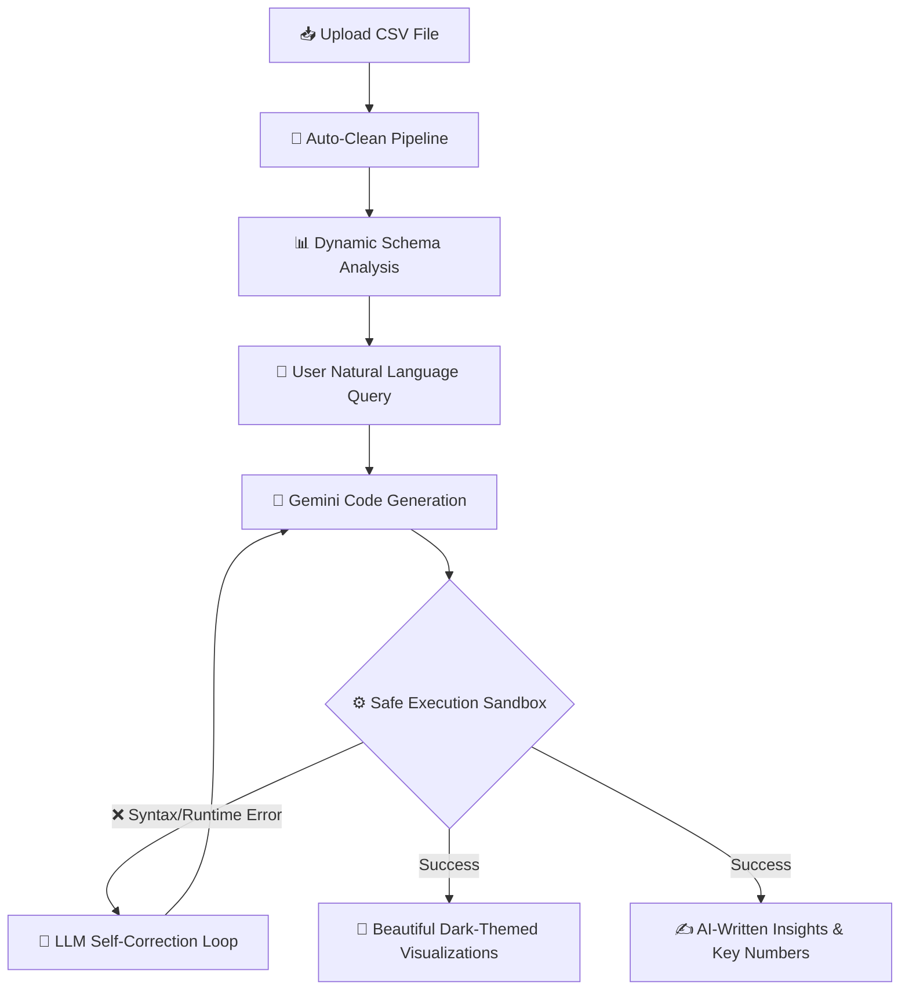

# 🧠 Smart Data Agent — Virtual Data Scientist 📊✨

<p align="center">
  
  
  
</p>

<p align="center">
  <a href="https://github.com/GoogleGemini">
    
  </a>
  <a href="https://streamlit.io">
    
  </a>
  <a href="https://python.org">
    
  </a>
  <a href="https://opensource.org/licenses/MIT">
    
  </a>
</p>

---

## 🌟 Overview

Welcome to the **Smart Data Agent**, your personal **Virtual Data Scientist**! 🚀
This powerful AI-driven application allows anyone—regardless of their technical background—to instantly clean, analyze, visualize, and generate insights from CSV datasets using natural language queries. Powered by the state-of-the-art **Google Gemini 2.0 Flash** model, it translates your questions into executable Python code, runs it safely, and auto-corrects any errors on the fly.

---

## 🎨 Interactive Visual Guide



---

## 🔥 Key Features

- **📂 Seamless Drag-and-Drop:** Upload any CSV file, and the agent instantly maps its structure.
- **🧹 Auto-Cleaning Pipeline:** Automatically handles missing values, identifies column types, and normalizes headers.
- **💬 Natural Language Interface:** No SQL or Python knowledge needed. Simply ask: *"What are the top 5 profitable categories?"*
- **📊 Eye-Catching Visuals:** Beautiful, responsive, dark-themed charts (bar, line, scatter, correlation heatmaps) auto-generated based on query context.
- **🔄 Robust Self-Correction (Retry Loop):** If a generated script fails, the agent reads the error trace and automatically rewrites the code (up to 3 times).
- **📝 Contextual Insights:** Summarizes tabular outputs into clear, actionable business recommendations.

---

## 🛠️ Project Structure

Here is how the project is organized:

```bash
smart-data-agent/
├── app.py                   # 🖥️ Main Streamlit UI Entry Point
├── core/
│   ├── data_cleaning.py     # 🧹 Data Cleansing and Harmonization Pipeline
│   ├── visualizations.py    # 📊 Dark-Themed Plotly & Seaborn Generators
│   ├── code_executor.py     # 🔒 Sandboxed Execution Workspace
│   └── agent.py             # 🧠 Gemini Agent Loop with Self-Correction
├── data/                    # 📁 User-Uploaded Datasets
├── outputs/                 # 🖼️ Rendered Charts and Figures
├── requirements.txt         # 📦 Required Python Libraries
└── githubread/
    └── README.md            # 🎨 Colorful Project Guide (This File)
```

---

## 🚀 Quick Start Guide

### 1️⃣ Clone & Navigate
```bash
git clone https://github.com/your-username/smart-data-agent.git
cd smart-data-agent
```

### 2️⃣ Initialize Virtual Environment
```bash
python -m venv venv
# Windows PowerShell
.\venv\Scripts\Activate.ps1
# macOS/Linux
source venv/bin/activate
```

### 3️⃣ Install Dependencies
```bash
pip install -r requirements.txt
```

### 4️⃣ Set Gemini API Key
Provide your Gemini API Key by setting the environment variable:
```bash
# Windows Command Prompt
set GEMINI_API_KEY=your_api_key_here

# Windows PowerShell
$env:GEMINI_API_KEY="your_api_key_here"

# macOS/Linux
export GEMINI_API_KEY="your_api_key_here"
```

### 5️⃣ Launch the App!
```bash
streamlit run app.py
```

---

## 💡 Smart Queries To Try

| ❓ What You Ask | 📈 Expected Result |
| :--- | :--- |
| **"Show me the distribution of sales"** | 📊 Histogram + KDE curve with custom themes |
| **"Which product category has the highest revenue?"** | 🏆 Grouped bar chart with sorted values |
| **"Show monthly sales trends"** | 📈 Time-series line chart with peak annotation |
| **"What's the correlation between price and sales?"** | 🌡️ Correlation heatmap with annotated values |
| **"Top 10 items by profit margin"** | 🥇 Horizontal bar chart with color scale |

---

## 🛡️ License

Distributed under the **MIT License**. See `LICENSE` for more information.

---

<p align="center">
  Made with ❤️ using Google Gemini & Streamlit.
</p>
